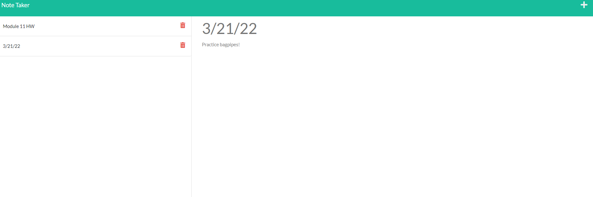

# My-Notes, A Notetaker App

## Description:

Using API routes, this app allows a user to create, edit, store, and delete notes.

## Testing Instructions:

Upon page load the user may create a new note using a title and note text. Once the user finishes inputting information they may save the file. The user can select between any saved note. The user can delete any note.

## Link to deployed App:

https://asafran92-my-notes.herokuapp.com/notes

## Screenshot of App in use:

## Built With:

- HTML
- CSS
- Javascript
- Express.JS

## Contribution:

Made with ❤️ by Avrumie Safranovitz
